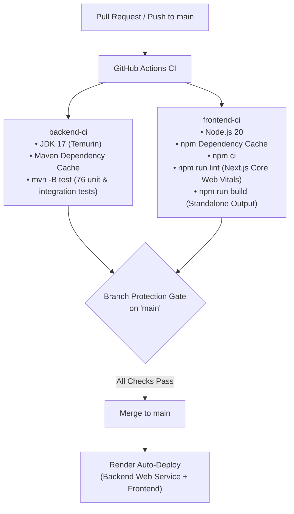

# Continuous Integration & Branch Protection Guide: GitHub CodeRAG

This repository uses **GitHub Actions** to automate automated testing and build verification for both the Spring Boot backend and the Next.js frontend on every pull request and push to `main`.

---

## 1. CI Workflow Architecture

The workflow definition is located at [`.github/workflows/ci.yml`](file:///.github/workflows/ci.yml).



- **Backend CI Job (`backend-ci`)**:
  - Sets up Java 17 with Maven caching.
  - Executes `mvn -B test` against in-memory H2 database.
  - Verifies auth flows, file filtering, chunking logic, hybrid search scoring, rate limiting, and intelligence endpoints.
  - Requires **zero external credentials** (Gemini and Qdrant calls are mocked).
- **Frontend CI Job (`frontend-ci`)**:
  - Sets up Node.js 20 with npm caching.
  - Runs `npm ci` for clean reproducible installs.
  - Executes `npm run lint` for ESLint verification.
  - Executes `npm run build` to verify Next.js standalone compilation.

---

## 2. Setting Up Branch Protection on GitHub

Because Render automatically deploys whenever code lands on `main`, branch protection is the critical security gate preventing broken code from reaching production.

### Step-by-Step Instructions:

1. **Navigate to Repository Settings**:
   - Open your GitHub repository in your browser.
   - Click the **Settings** tab at the top right.

2. **Open Branches Section**:
   - In the left sidebar, under **Code and automation**, click **Branches**.

3. **Add Branch Ruleset / Protection Rule**:
   - Click **Add classic branch protection rule** (or **Add branch ruleset**).
   - **Branch name pattern**: Type `main`.

4. **Enable Required Status Checks**:
   - Check **Require a pull request before merging**.
   - Check **Require status checks to pass before merging**:
     - Check **Require branches to be up to date before merging**.
     - In the status checks search box, search for and select:
       1. `Backend CI (Java 17 / Spring Boot)`
       2. `Frontend CI (Node 20 / Next.js)`
   - *(Optional)* Check **Require conversation resolution before merging**.
   - *(Recommended)* Check **Do not allow bypassing the above settings** (applies rules to repository administrators as well).

5. **Save Changes**:
   - Click **Create** or **Save changes** at the bottom.

---

## 3. Verifying the CI Pipeline

1. **Create a Feature Branch**:
   ```bash
   git checkout -b feature/test-ci
   ```
2. **Push Branch & Open a Pull Request**:
   ```bash
   git push origin feature/test-ci
   ```
   Open a PR targeting `main`. Both `Backend CI` and `Frontend CI` will trigger in parallel.
3. **Inspect PR Status**:
   - Both checks must show green checkmarks (`✓`) before GitHub allows merging.
   - If any test or build fails, GitHub will block the merge button with a clear error indication pointing to the failed job.
