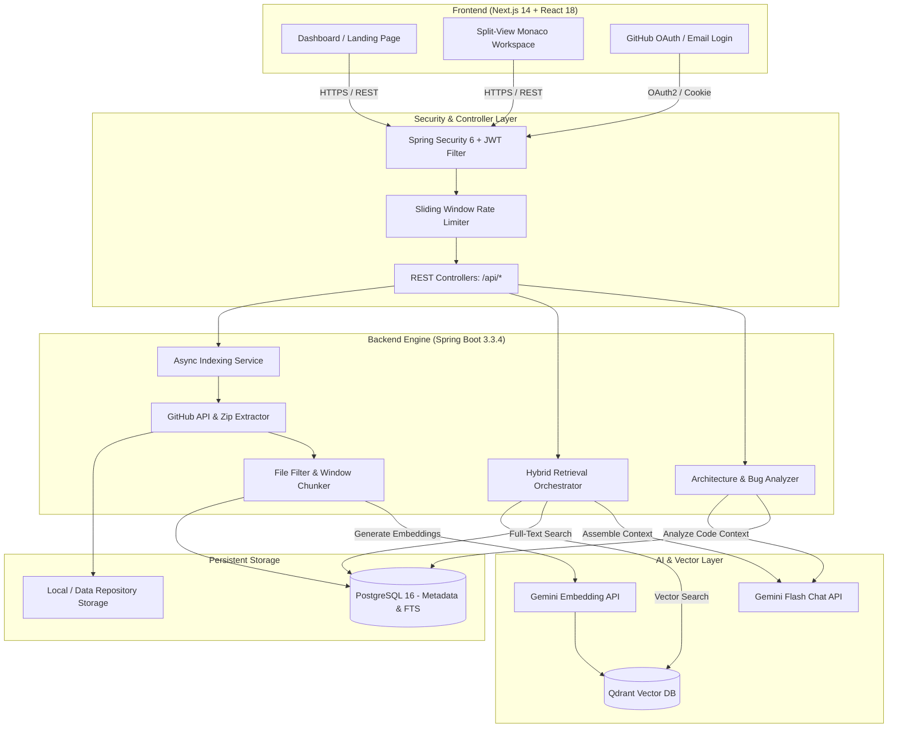

# 🚀 RepoPilot (GitHub CodeRAG)

[](https://github.com/Omkarbhure/Github-CodeRag/actions/workflows/ci.ym)
[](https://openjdk.org/projects/jdk/17/)
[](https://spring.io/projects/spring-boot)
[-black?style=flat&logo=next.js&logoColor=white)](https://nextjs.org/)
[](https://www.postgresql.org/)
[](https://qdrant.tech/)
[](https://ai.google.dev/)
[](LICENSE)

> **RepoPilot (GitHub CodeRAG)** is an enterprise-grade Retrieval-Augmented Generation (RAG) platform and developer intelligence workspace. It ingests public GitHub repositories, performs AST-aware chunking and hybrid vector/keyword indexing, and powers an interactive split-view Monaco workspace for grounded code questioning, bug investigation, and architectural synthesis with strict line-level citations.

---

## 🌟 Key Features

### 🔍 1. Hybrid Search Retrieval (Dense Vector + Sparse Keyword)
- **Qdrant Vector Search**: Cosine distance similarity search across 768-dimensional embeddings generated via Google Gemini (`gemini-embedding-001` / `text-embedding-004`).
- **PostgreSQL Full-Text Search**: Native PostgreSQL `tsvector` and `GIN` indexed full-text search with `ts_rank` scoring.
- **Reciprocal & Weighted Score Fusion**: Concurrently retrieves and normalizes dense and sparse search scores (`finalScore = α * normVec + β * normKw`) with configurable weights (`0.7` vector / `0.3` keyword) for pinpoint lexical and semantic recall.

### 💬 2. Grounded RAG Chat & Interactive Citations
- **Zero-Hallucination Prompts**: System instructions force the LLM to ground answers exclusively in retrieved repository code chunks.
- **Line-Level Citations**: Every code snippet cited by the assistant outputs strict `[filePath:startLine-endLine]` tags.
- **Interactive Citation Badges**: The frontend parses citation tags into clickable interactive chips that navigate directly to the file and highlight exact line ranges in real time.

### 💻 3. Split-View Monaco Editor Workspace
- **Dual-Pane Interface**: Left pane provides multi-threaded conversational chat with markdown rendering and prompt suggestions; right pane embeds a full read-only `@monaco-editor/react` workspace.
- **Dynamic Syntax Highlighting**: Auto-detects 20+ programming languages with line number mapping and delta decorations.
- **Related Files Drawer**: Computes vector similarity and symbol import references to display related source files with one-click navigation.

### 🧠 4. Developer Intelligence Suite
- **Automated Architecture Overview**: Synthesizes directory structure, build manifests, and entry points to generate components, data flows, and tech stacks, cached per commit SHA.
- **Stack Trace & Bug Investigation**: Parses multi-language stack traces (Java, Python, JS/TS, Go), resolves exact source code chunks, and pinpoints root causes with suggested fixes.

### ⚡ 5. High-Throughput Ingestion & Storage Pipeline
- **Smart File Filtering**: Automatically parses source code while filtering binaries, media, build artifacts (`target/`, `node_modules/`, `.git/`), and auto-generated files.
- **Low-Value & Minified Code Detection**: Heuristic engine excludes minified code, bundler chunks, and machine-generated code to optimize embedding budgets.
- **Streaming Guardrails**: Enforces 100MB repository caps, 10MB individual file caps, and Zip Slip path traversal security.
- **Asynchronous Execution**: Thread-pooled background worker with real-time job status polling (`DOWNLOADING -> SCANNING -> CHUNKING -> EMBEDDING -> COMPLETED`).

### 🛡️ 6. Dual Authentication & Security
- **Email/Password & GitHub OAuth2**: Supports native registration as well as GitHub OAuth login with account linking.
- **Stateless HttpOnly JWT**: Secure session cookies (`coderag_token`) with CSRF protection, CORS allow-lists, and edge route guards.
- **Rate Limiting & Daily Quota Guard**: Sliding-window rate limiters per user action and daily Gemini API call quotas.

---

## 🏗️ System Architecture



---

## 🛠️ Tech Stack

### Frontend
- **Framework**: [Next.js 14](https://nextjs.org/) (App Router, Server & Client Components)
- **Language**: [TypeScript 5](https://www.typescriptlang.org/)
- **UI & Styling**: [Tailwind CSS](https://tailwindcss.com/), [Lucide React](https://lucide.dev/)
- **Code Editor**: [@monaco-editor/react](https://github.com/suren-atoyan/monaco-react)
- **State & Networking**: React Context API, Native Fetch with `credentials: 'include'`

### Backend
- **Framework**: [Spring Boot 3.3.4](https://spring.io/projects/spring-boot) (Java 17)
- **Security**: Spring Security 6 (Stateless JWT, OAuth2 Client, HttpOnly Cookies)
- **Data & ORM**: Spring Data JPA, Hibernate 6, [Flyway Migrations](https://flywaydb.org/)
- **Connection Pool**: HikariCP
- **Async Execution**: Spring `@Async` ThreadPoolTaskExecutor
- **Testing**: JUnit 5, Mockito, Spring Security Test, H2 In-Memory DB

### AI & Vector Services
- **LLM Synthesis**: Google Gemini (`gemini-3.6-flash` / `gemini-1.5-flash`)
- **Embedding Model**: Google Gemini (`gemini-embedding-001` / `text-embedding-004`, 768 dimensions)
- **Vector Database**: [Qdrant](https://qdrant.tech/) (Cosine Distance, Payload Indexing)

### Database & Infrastructure
- **Primary Database**: PostgreSQL 16 (Full-Text Search with `tsvector` and `GIN` Indexing)
- **Containers**: Docker & Docker Compose
- **CI/CD**: GitHub Actions (Parallel multi-stage test & build validation)

---

## 📂 Repository Structure

```text
repopilot/
├── .github/workflows/ci.yml       # GitHub Actions CI/CD Pipeline
├── docker-compose.yml             # Local PostgreSQL 16 & Qdrant services
├── backend/                       # Spring Boot 3.3.4 Application
│   ├── src/main/java/com/example/coderag/
│   │   ├── config/                # SecurityConfig, CorsConfig, DatabaseConfig, AsyncConfig
│   │   ├── controller/            # Auth, Repository, Chat, Intelligence, Health
│   │   ├── dto/                   # Request / Response DTOs & Search Payloads
│   │   ├── exception/             # GlobalExceptionHandler & Custom Exceptions
│   │   ├── github/                # GitHubApiClient, ZipDownloadService, FileFilterService
│   │   ├── model/                 # User, GitHubRepository, RepositoryFile, CodeChunk, Message
│   │   ├── repository/            # Spring Data JPA & Full-Text Search Repositories
│   │   ├── security/              # JwtService, CookieService, OAuth2SuccessHandler
│   │   └── service/               # HybridSearch, GeminiService, QdrantService, ChunkerService
│   ├── src/main/resources/
│   │   ├── application.yml        # Config & externalized environment variables
│   │   └── db/migration/          # Flyway migration scripts (V1 through V6)
│   └── pom.xml                    # Maven dependencies & build definitions
└── frontend/                      # Next.js 14 Frontend Application
    ├── src/
    │   ├── app/                   # App Router: /, /login, /signup, /dashboard, /repositories/[id]
    │   ├── components/            # Monaco viewer, Chat panels, Citation chips, Brand logo
    │   ├── context/               # AuthContext (session state via HttpOnly cookie)
    │   ├── lib/                   # api.ts fetch client & route definitions
    │   └── types/                 # TypeScript interfaces for Auth, Repo, Search, Chat
    ├── tailwind.config.ts         # Theme and custom animations
    └── package.json               # Frontend dependencies & scripts
```

---

## 🚀 Getting Started

### Prerequisites
- **Java**: OpenJDK 17 or higher
- **Maven**: 3.9+
- **Node.js**: 20.x+ & npm
- **Docker & Docker Compose**: (Optional for local PostgreSQL & Qdrant)
- **API Keys**: Google Gemini API key and GitHub OAuth App credentials

---

### 1. Clone the Repository
```bash
git clone https://github.com/Omkarbhure/Github-CodeRag.git
cd Github-CodeRag
```

---

### 2. Start Supporting Services (Docker)
You can start PostgreSQL and Qdrant locally using Docker Compose:
```bash
docker compose up -d
```
*Services started:*
- **PostgreSQL 16**: `localhost:5433` (DB: `coderag`, User: `postgres`, Pass: `postgres`)
- **Qdrant Vector DB**: `localhost:6333` (REST API)

---

### 3. Configure Environment Variables

#### Backend (`backend/.env` or system environment):
```env
# Server & Database
PORT=8081
SPRING_DATASOURCE_URL=jdbc:postgresql://localhost:5433/coderag
DB_USER=postgres
DB_PASSWORD=postgres

# GitHub OAuth Credentials
GITHUB_CLIENT_ID=your_github_client_id
GITHUB_CLIENT_SECRET=your_github_client_secret

# Google Gemini AI
GEMINI_API_KEY=your_gemini_api_key
CHAT_MODEL=gemini-3.6-flash
EMBEDDING_MODEL=gemini-embedding-001

# Vector Database (Qdrant)
QDRANT_URL=http://localhost:6333
QDRANT_COLLECTION=code_chunks

# Security & CORS
JWT_SECRET=404E635266556A586E3272357538782F413F4428472B4B6250645367566B5970
COOKIE_SECURE=false
COOKIE_SAME_SITE=Lax
FRONTEND_URL=http://localhost:3000
ALLOWED_ORIGINS=http://localhost:3000
```

#### Frontend (`frontend/.env.local`):
```env
NEXT_PUBLIC_API_URL=http://localhost:8081
```

---

### 4. Build & Run Backend
```bash
cd backend
mvn clean spring-boot:run
```
Backend will start on [http://localhost:8081](http://localhost:8081).
Flyway will automatically execute database migrations (`V1` to `V6`).

---

### 5. Build & Run Frontend
```bash
cd frontend
npm install
npm run dev
```
Frontend will be accessible at [http://localhost:3000](http://localhost:3000).

---

## 📡 Core API Reference

| Method | Endpoint | Description | Auth Required |
| :--- | :--- | :--- | :---: |
| `GET` | `/api/health` | Uptime and service status probe | No |
| `POST` | `/api/auth/register` | Register with email & password | No |
| `POST` | `/api/auth/login` | Authenticate and obtain JWT cookie | No |
| `GET` | `/oauth2/authorization/github` | Trigger GitHub OAuth2 login flow | No |
| `GET` | `/api/me` | Fetch authenticated user profile | Yes |
| `POST` | `/api/repositories` | Ingest and index a GitHub repository | Yes |
| `GET` | `/api/repositories` | List user's indexed repositories | Yes |
| `GET` | `/api/repositories/{id}` | Get repository status & indexing metrics | Yes |
| `GET` | `/api/repositories/{id}/files` | Browse repository file tree | Yes |
| `GET` | `/api/repositories/{id}/files/content?path=...` | Read raw source file content | Yes |
| `POST` | `/api/repositories/{id}/search` | Hybrid semantic + keyword search | Yes |
| `POST` | `/api/repositories/{id}/conversations` | Create a new RAG conversation thread | Yes |
| `POST` | `/api/conversations/{id}/messages` | Send prompt & receive grounded answer | Yes |
| `POST` | `/api/repositories/{id}/architecture-overview` | Generate architecture synthesis | Yes |
| `POST` | `/api/repositories/{id}/investigate-bug` | Parse stack trace & diagnose bug | Yes |
| `GET` | `/api/repositories/{id}/files/related?path=...`| Discover semantically related files | Yes |

---

## 🧪 Testing & CI/CD Pipeline

The project includes unit and integration tests across both the backend and frontend.

### Run Backend Tests (77 Unit & Integration Tests)
```bash
cd backend
mvn test
```
*Tests run with an in-memory H2 database with zero external credentials required.*

### Run Frontend Lint & Build
```bash
cd frontend
npm run lint
npm run build
```

------------------------------------------------------------------------------------------------------------------------------------------------------------------------------------------------------------------------------------------


